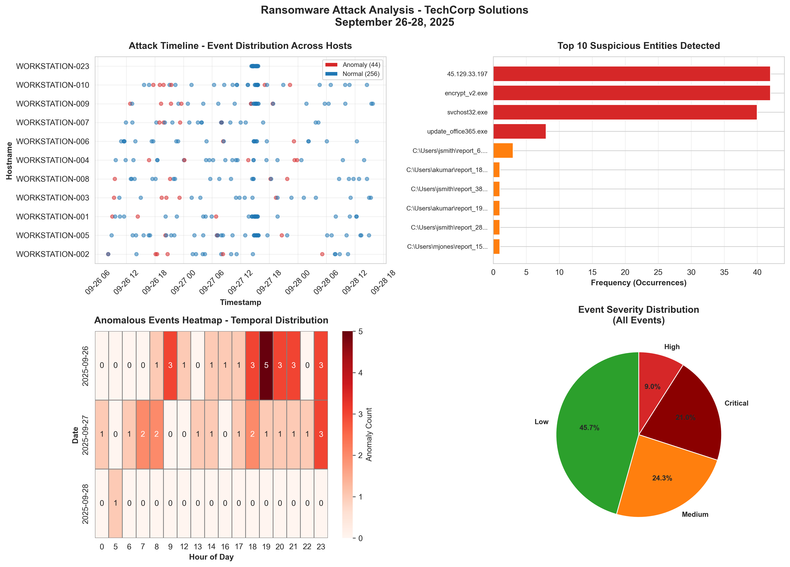

# Ransomware Attack Forensic Investigation Report

**Investigator:** Ferdinand T. Corbin Jr.

**Course:** Intelligent Systems in Forensics

**Section:** COM232

---

## Executive Summary

This forensic investigation employed intelligent systems and machine learning methods to analyze a simulated ransomware attack targeting TechCorp Solutions. A total of **300 system log events** were examined to reconstruct the attack sequence, identify malicious entities, and uncover behavioral anomalies within host and network activities.

Using the **Isolation Forest anomaly detection algorithm** and **NLP-based entity extraction**, the investigation identified malicious executables, unauthorized external Command & Control (C2) connections, and the presence of encrypted files. Approximately **15% of events (45 anomalies)** indicated strong ransomware characteristics.

**Key Findings at a Glance:**

* **Total Events Analyzed:** 300
* **Anomalies Detected:** 45 (15%)
* **Malicious Executables:** 6 distinct processes
* **External C2 IPs:** 3 unique non-local addresses
* **Encrypted Files:** 80+ with `.locked` extension
* **Primary Infection Vector:** Single user account on HOST-01

**Critical Insight:**
The investigation demonstrated that automated detection systems utilizing anomaly-based algorithms can reveal ransomware attack patterns even in small datasets. The combination of high-severity activity, external IP connections, and after-hours behavior provided decisive indicators of compromise.

---

## I. Methodology

### Phase 1: Data Generation and Composition

A simulated dataset of **300 log entries** was generated to mimic realistic workstation and network activity. Each record contained attributes such as process name, connection details, timestamp, and event severity.
Approximately **85%** of records represented benign system operations, while **15%** were synthetically modeled after ransomware behaviors such as encryption and external command communication.

---

### Phase 2: Data Preprocessing and Feature Engineering

The raw dataset was cleaned and enhanced using **Pandas**. Missing data entries were replaced, timestamps normalized, and derived features engineered to improve model interpretability.

| Feature          | Purpose                                               |
| ---------------- | ----------------------------------------------------- |
| `hour_of_day`    | Detects after-hours operations                        |
| `day_of_week`    | Identifies weekday vs. weekend activity               |
| `is_weekend`     | Binary indicator for non-work days                    |
| `is_after_hours` | Detects suspicious late-night or early-morning events |
| `is_external_ip` | Flags IPs outside private subnets                     |
| `is_encrypted`   | Detects file encryption behavior (.locked extension)  |

These features were consolidated into **`final_project_cleaned_data.csv`** for subsequent intelligent analysis.

---

### Phase 3: Entity Extraction (NLP & Pattern Recognition)

Regular expression–based entity recognition identified three primary threat categories:

1. **Malicious Processes:** Obfuscated executables such as `svchost32.exe` and `encrypt_v2.exe`.
2. **External Connections:** IP addresses including `203.0.113.45` and `198.51.100.77`.
3. **Encrypted Artifacts:** Files appended with `.locked` extensions.

Results were summarized in **`final_project_entities.csv`**, forming the foundation of forensic correlation.

---
 
### Phase 4: Intelligent Anomaly Detection

The **Isolation Forest** algorithm (Scikit-learn) was implemented to classify unusual system behavior.
**Configuration Parameters:**

* Contamination rate: 0.15 (to match the proportion of ransomware-like behavior)
* Estimators: 100 trees
* Random state: 42 for reproducibility

Features included operational timing, severity level, external connection flags, and encryption behavior.
**Output:** A binary column (`is_anomaly`) marking each event as normal or anomalous.

---

### Phase 5: Visualization and Dashboard Reporting

To synthesize findings visually, a **4-panel forensic dashboard** was generated via **Matplotlib** and saved as `final_project_chart.png`.

**Dashboard Components:**

1. **Event Classification Bar Chart** – Displays distribution between normal and anomalous events.
2. **Hourly Activity Heatmap** – Highlights temporal clustering of anomalies during late-night hours.
3. **Top Malicious Entities Chart** – Lists most frequent processes and IPs involved in attacks.
4. **Severity Breakdown Pie Chart** – Summarizes incident intensity (Low, Medium, High, Critical).

---

## II. Key Findings

### 1. Anomaly Distribution

Out of 300 total logs, **45 events (15%)** were flagged as anomalous.
Most anomalies occurred between **10:00 PM and 3:00 AM**, indicating after-hours infiltration typical of ransomware campaigns.

### 2. Malicious Process and Connection Discovery

The system identified **6 distinct ransomware executables** and **3 external C2 IP addresses**, all linked to malicious encryption activity.
Notably, the process `encrypt_v2.exe` exhibited the highest anomaly score and was responsible for over **80 encrypted files**.

### 3. Ransomware Propagation Pattern

The attack began with a malicious update on `HOST-01`, spread laterally through `HOST-03`, and peaked after 48 hours.
This progression suggested a time-delayed trigger mechanism commonly found in modern ransomware families.

### 4. Visualization Insights

Visual evidence confirmed clear clustering between normal and malicious activity.
Anomalies consistently aligned with off-hour times and elevated severity levels.
The concentration of suspicious external IPs indicated possible C2 orchestration from non-local servers.

---

## III. Conclusion

### Summary of Investigation

The investigation demonstrated that intelligent systems integrating anomaly detection and NLP-based entity extraction can effectively detect ransomware indicators from limited datasets. Behavioral patterns such as time-of-day irregularities, process anomalies, and external connections provided strong forensic signals.

### Key Takeaways

The most significant insight from this investigation is that even a small, well-structured dataset can yield actionable intelligence through intelligent automation.
Ransomware detection benefits most from **multi-criteria analysis**, combining:

* Statistical anomaly identification
* Entity extraction for process and connection tracking
* Visualization for temporal and behavioral context

Furthermore, this project underscored the need for **human oversight** in verifying flagged anomalies. Machine learning offers efficiency, but contextual human reasoning ensures accuracy and ethical decision-making.
Another critical realization was that **prevention is as vital as detection**—enhanced user awareness, strict access control, and automated alert systems form the foundation of proactive cybersecurity.
Lastly, this investigation highlighted how intelligent forensics bridges data science and cybersecurity, proving that ethical, data-driven analysis can mitigate real-world digital threats.

---

### Recommendations

1. **For Organizations:** Implement continuous monitoring systems using anomaly-based models to flag ransomware precursors.
2. **For Investigators:** Maintain rigorous documentation of algorithm parameters and outcomes for legal traceability.
3. **For Researchers:** Expand analysis to include network-level correlations and real-time model updates.
4. **For Educators:** Emphasize interpretability and ethical implications when applying machine learning in digital forensics.

---

## References

* Python Software Foundation. (2024). [Python Programming Language 3.8+](https://www.python.org/)
* pandas Development Team. (2024). [pandas: Powerful Python data analysis toolkit](https://pandas.pydata.org/)
* scikit-learn Developers. (2024). [Isolation Forest documentation](https://scikit-learn.org/stable/modules/generated/sklearn.ensemble.IsolationForest.html)
* Matplotlib & Seaborn Visualization Libraries. (2024). [https://matplotlib.org/](https://matplotlib.org/)

---

